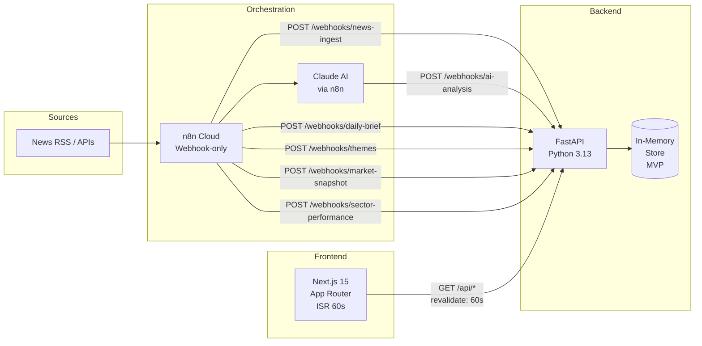

# ASK — Aware Signals & Knowledge

> *From news to understanding.*

AI-powered financial research companion for Thai retail investors. ASK (Aware Signals & Knowledge) aggregates financial news, generates per-article AI impact analysis, groups related articles into market themes, and delivers a daily market brief — all without requiring users to read dozens of articles.

> **What ASK is not:** An investment advisory service, a trading recommendation system, or a real-time execution tool. Every AI-generated surface displays a non-removable compliance disclaimer.

---

## Architecture



**Three write paths, one read path.** n8n pushes data into FastAPI via webhooks on schedule; Next.js pulls via ISR. They are fully decoupled — the frontend never calls n8n directly, and n8n never reads from the frontend.

---

## Tech Stack

| Layer | Technology | Version |
|---|---|---|
| Frontend | Next.js App Router | 15.1.0 |
| Frontend | React | 19.0.0 |
| Frontend | TypeScript (strict) | ^5 |
| Frontend | Tailwind CSS | ^3.4.17 |
| Backend | FastAPI | 0.115.0 |
| Backend | Pydantic v2 | 2.9.2 |
| Backend | Python | 3.13 |
| Backend | httpx | 0.27.2 |
| Orchestration | n8n Cloud | webhook-only |
| AI | Claude (Anthropic) | via n8n |

---

## Prerequisites

- Node 20+ and npm
- Python 3.13 and pip
- An n8n Cloud account (for pipeline integration)

---

## Local Development

### Backend

```bash
cd backend
python3 -m venv venv
source venv/bin/activate          # Windows: venv\Scripts\activate
pip install -r requirements.txt
cp .env.example .env              # edit as needed
uvicorn app.main:app --reload --port 8000
```

API available at `http://localhost:8000` · Swagger UI at `http://localhost:8000/docs`

### Frontend

```bash
cd frontend
npm install
# create .env.local if NEXT_PUBLIC_API_URL needs overriding (defaults to http://localhost:8000)
npm run dev
```

App available at `http://localhost:3000`

> The backend must be running before the frontend dev server for API calls to resolve.

### Running Tests

```bash
# Frontend (Vitest + React Testing Library)
cd frontend && npx vitest run

# Backend (pytest + pytest-asyncio)
cd backend && pytest
```

---

## Project Structure

```
ASK/
├── frontend/
│   └── src/
│       ├── app/                        # Next.js App Router pages
│       │   ├── page.tsx                # Home (Daily Brief + Market sidebar + News feed)
│       │   ├── layout.tsx              # Root layout (Navbar, BottomTabBar, fonts)
│       │   ├── news/
│       │   │   ├── page.tsx            # News feed with category filter
│       │   │   └── [id]/page.tsx       # News detail (AI analysis, sentiment, disclaimer)
│       │   ├── trends/
│       │   │   ├── page.tsx            # Market themes list
│       │   │   └── [id]/page.tsx       # Theme detail with constituent articles
│       │   ├── stocks/page.tsx         # Market overview + sector heatmap
│       │   └── about/page.tsx          # Disclaimer and product scope
│       ├── components/
│       │   ├── AIInsightBox.tsx        # AI analysis block (pending/stale/available states)
│       │   ├── AISummaryCard.tsx       # Compact AI summary for detail pages
│       │   ├── BottomTabBar.tsx        # Mobile-only fixed nav (4 tabs)
│       │   ├── CategoryFilterBar.tsx   # Scrollable tab filter (role="tablist")
│       │   ├── DailyBriefCard.tsx      # Zone 1 (header/sentiment) + Zone 2 (content/disclaimer)
│       │   ├── DailyBriefServer.tsx    # Async server wrapper for DailyBriefCard
│       │   ├── MarketOverviewWidget.tsx # Index rows with ▲/▼ non-color indicators
│       │   ├── N8nChat.tsx             # Embedded n8n chat widget
│       │   ├── Navbar.tsx              # Desktop nav + Bangkok clock + LIVE badge
│       │   ├── NewsCard.tsx            # Headline + SentimentBadge + AIInsightBox + footer
│       │   ├── NewsDetailContent.tsx   # Full article detail layout
│       │   ├── NewsFeed.tsx            # News list with staleness banner
│       │   ├── SectorHeatmap.tsx       # Color cells + percentage text (WCAG 1.4.1)
│       │   ├── SentimentBadge.tsx      # Pill: ● BULLISH / ● BEARISH / ● NEUTRAL
│       │   ├── SkeletonCard.tsx        # Generic animate-pulse skeleton
│       │   ├── ThemeCard.tsx           # Theme name + sentiment + article count + preview
│       │   ├── ThemeDetailContent.tsx  # Constituent articles with AI analysis
│       │   ├── TickerBar.tsx           # CSS marquee ticker (decorative, aria-hidden)
│       │   └── TrendSummary.tsx        # Sidebar: top 3 themes ranked by recency
│       ├── lib/
│       │   └── api.ts                  # All fetch calls (revalidate: 60 on every call)
│       └── types/
│           └── index.ts                # TypeScript types — manually synced with schemas.py
│
├── backend/
│   └── app/
│       ├── main.py                     # FastAPI app, CORS, lifespan, router registration
│       ├── ai/
│       │   └── prompts.py              # Version-controlled Claude system prompt
│       ├── models/
│       │   └── schemas.py              # All Pydantic models (snake_case, AwareDatetime)
│       ├── routers/                    # HTTP layer only — no business logic
│       │   ├── news.py                 # GET /api/news, /api/news/{id}, /api/news/categories
│       │   ├── market.py               # GET /api/market/snapshot, /indices, /sectors, /overview
│       │   ├── trends.py               # GET /api/trends, /api/trends/{id}
│       │   ├── daily_brief.py          # GET /api/daily-brief
│       │   └── webhooks.py             # POST /webhooks/* (all idempotent)
│       └── services/                   # Business logic and in-memory stores
│           ├── news_store.py           # NewsStore: upsert, dedup, 7-day retention
│           ├── theme_store.py          # ThemeStore: upsert, 48h auto-archive
│           ├── daily_brief_store.py    # DailyBriefStore: upsert by brief_date
│           ├── market_snapshot_store.py # MarketSnapshotStore: latest snapshot
│           ├── sector_performance_store.py # SectorPerformanceStore: latest sectors
│           └── mock_data.py            # Seed data for local development
│
└── _bmad-output/
    ├── project-context.md              # 91 critical implementation rules for AI agents
    ├── planning-artifacts/             # PRD, Architecture, UX spines, Epics
    └── implementation-artifacts/       # 28 story files + deferred-work.md
```

---

## API Reference

### Read endpoints (GET)

| Endpoint | Description | ISR |
|---|---|---|
| `GET /api/news` | News feed (7-day window, sorted by `published_at` desc) | 60s |
| `GET /api/news/{id}` | Single news item with AI analysis | 60s |
| `GET /api/news/categories` | Supported category list | 60s |
| `GET /api/daily-brief` | Today's brief (falls back to yesterday if not yet generated) | 60s |
| `GET /api/trends` | Active themes (excludes `last_article_at` > 48h) | 60s |
| `GET /api/trends/{id}` | Theme detail with constituent articles | 60s |
| `GET /api/market/snapshot` | Latest market snapshot (indices + tickers) | 60s |
| `GET /api/market/overview` | Market overview with sector summary | 60s |
| `GET /api/market/sectors` | Sector performance list | 60s |
| `GET /api/market/indices` | Index list | 60s |

### Webhook endpoints (POST — idempotent)

| Endpoint | Triggered by | Dedup key |
|---|---|---|
| `POST /webhooks/news-ingest` | n8n on news fetch | URL + content hash |
| `POST /webhooks/ai-analysis` | n8n after Claude analysis | article ID |
| `POST /webhooks/daily-brief` | n8n at 07:00 Bangkok daily | `brief_date` |
| `POST /webhooks/themes` | n8n after theme clustering | `theme_id` |
| `POST /webhooks/market-snapshot` | n8n on market data push | replaces previous |
| `POST /webhooks/sector-performance` | n8n on sector data push | replaces previous |

Full API documentation available at `http://localhost:8000/docs` when the backend is running.

---

## Data Flow

### News lifecycle

```
n8n (scheduled)
  → POST /webhooks/news-ingest        ← idempotent; dedup by URL + content hash
  → n8n triggers Claude analysis
  → POST /webhooks/ai-analysis        ← attaches sentiment, sectors, stocks to article
  → GET /api/news (ISR 60s)           ← Next.js serves cached response
  → NewsCard renders with AIInsightBox
```

### Daily Brief lifecycle

```
n8n (07:00 Bangkok time daily)
  → POST /webhooks/daily-brief        ← upsert by brief_date
  → GET /api/daily-brief (ISR 60s)    ← falls back to yesterday if today not yet generated
  → DailyBriefCard renders on home page
```

### Theme lifecycle

```
n8n (daily, after news + analysis batch)
  → POST /webhooks/themes             ← upsert by theme_id; validates constituent article IDs
  → GET /api/trends (ISR 60s)         ← excludes themes where last_article_at > 48h
  → ThemeCard list renders on /trends
```

---

## Key Conventions

These rules exist because violating them causes silent bugs in a financial product. All 91 rules are documented in [`_bmad-output/project-context.md`](./_bmad-output/project-context.md).

### The most important ones

**Schema sync — #1 source of silent bugs**

`frontend/src/types/index.ts` and `backend/app/models/schemas.py` are kept in sync manually. Both use `snake_case`. No `alias=` in Pydantic — ever. Optional Pydantic fields serialize as `null`; TypeScript types must be `T | null`, not `T?`.

**Sentiment and direction are unions, not strings**

```typescript
// ✅ correct
sentiment: "bullish" | "bearish" | "neutral"

// ❌ wrong — freeform strings are a financial data bug
sentiment: string
```

Enforced at Pydantic, TypeScript, and UI layers.

**`isFinite()` before every number format**

```typescript
// ✅ correct
isFinite(value) ? value.toFixed(2) : "—"

// ❌ wrong — NaN.toFixed(2) throws at runtime
value.toFixed(2)
```

**`revalidate: 60` must be consistent per URL**

All calls to the same endpoint in `src/lib/api.ts` use the same revalidate value. Mixing `60` and `0` for the same URL produces undefined cache behavior.

**Every async Server Component needs its own Suspense boundary**

```tsx
// ✅ correct — each widget fails independently
<Suspense fallback={<MarketOverviewWidgetSkeleton />}>
  <MarketOverviewSection />
</Suspense>
<Suspense fallback={<SectorHeatmapSkeleton />}>
  <SectorHeatmapSection />
</Suspense>

// ❌ wrong — one failure collapses all three widgets
<Suspense fallback={<SkeletonCard />}>
  <MarketSidebarServer />   {/* renders 3 widgets */}
</Suspense>
```

**The null prop pattern**

Server Components that fetch data pass `ComponentProp[] | null` to their display components:

```tsx
// null  → API error  → render error state with timestamp
// []    → empty data → render card with "No data" message
// [...] → normal render
```

**All datetimes are timezone-aware**

Pydantic uses `AwareDatetime`. Storage is UTC. The frontend converts to Bangkok time (UTC+7) for display. Timezone-naive datetimes must never reach the UI layer.

**Webhook endpoints are idempotent**

n8n retries failed webhooks. Every `POST /webhooks/*` endpoint deduplicates by payload hash or event ID so retries produce no duplicate records.

**AI disclaimer is non-removable**

Every component rendering AI-generated content includes a structural disclaimer string. It is not a prop, not behind a feature flag, not conditional.

### Adding a new feature

1. Add Pydantic schema to `backend/app/models/schemas.py`
2. Add FastAPI route to the appropriate router in `backend/app/routers/`
3. Add TypeScript type to `frontend/src/types/index.ts` — mirror the Pydantic schema exactly
4. Add the API call to `frontend/src/lib/api.ts`
5. Build the component or page last

### Git conventions

```
feat: add sector heatmap component
fix: null handling in ticker bar
refactor: extract staleness indicator logic
test: add webhook idempotency tests
```

Branches: `feat/<feature>` · `fix/<issue>` · `chore/<task>`

---

## Environment Variables

### Backend (`backend/.env`)

| Variable | Default | Description |
|---|---|---|
| `APP_ENV` | `development` | Runtime environment |
| `ALLOWED_ORIGINS` | `http://localhost:3000` | CORS allowlist |
| `NEWS_RETENTION_DAYS` | `7` | Max age of news items in feed |
| `DAILY_BRIEF_TRIGGER_TIME` | `07:00` | Bangkok time for n8n brief generation |

### Frontend (`frontend/.env.local`)

| Variable | Default | Description |
|---|---|---|
| `NEXT_PUBLIC_API_URL` | `http://localhost:8000` | Backend base URL |

> Never commit `.env` files. n8n webhook UUIDs are live credentials — store in n8n environment variables, not source code, and rotate without a code deploy.

---

## Features

### MVP scope

| Capability | Status | Epic |
|---|---|---|
| Testing infrastructure (Vitest + pytest) | ✅ Done | Epic 1 |
| News feed with AI analysis & sentiment | ✅ Done | Epic 2 |
| Category filtering (5 categories) | ✅ Done | Epic 2 |
| News detail page with full AI analysis | ✅ Done | Epic 2 |
| WCAG 2.1 AA accessibility | ✅ Done | Epic 2 |
| News ingestion webhook (n8n → FastAPI) | ✅ Done | Epic 3 |
| AI analysis delivery webhook | ✅ Done | Epic 3 |
| Version-controlled Claude system prompt | ✅ Done | Epic 3 |
| Daily Market Brief card | ✅ Done | Epic 4 |
| Market Themes (Trends page) | ✅ Done | Epic 5 |
| Theme detail with constituent articles | ✅ Done | Epic 5 |
| Ticker Bar | ✅ Done | Epic 6 |
| Market Overview widget | ✅ Done | Epic 6 |
| Sector Heatmap widget | ✅ Done | Epic 6 |
| TrendSummary sidebar widget | ✅ Done | Epic 6 |

### Out of scope for MVP

User accounts · Portfolio tracking · Native mobile apps · Push notifications · AI chat (beyond n8n embedded widget) · Thai-language UI · Monetization · PostgreSQL persistence (in-memory MVP only)

---

## Supported News Categories

| Code | Label |
|---|---|
| `global-markets` | Global Markets |
| `thai-stocks` | Thai Stocks (SET) |
| `technology` | Technology |
| `energy` | Energy |
| `macroeconomics` | Macroeconomics |

---

## Planning & Implementation Artifacts

Full planning documentation is in [`_bmad-output/`](./_bmad-output/):

**Planning artifacts** (`_bmad-output/planning-artifacts/`):
- [`prds/prd-ASK-2026-06-20/prd.md`](./_bmad-output/planning-artifacts/prds/prd-ASK-2026-06-20/prd.md) — Product Requirements (29 FRs, 14 NFRs)
- [`architecture.md`](./_bmad-output/planning-artifacts/architecture.md) — Architecture decisions with per-requirement justification
- [`epics.md`](./_bmad-output/planning-artifacts/epics.md) — 6 epics, 28 stories with Given/When/Then acceptance criteria
- [`ux-designs/ux-ASK-2026-06-20/DESIGN.md`](./_bmad-output/planning-artifacts/ux-designs/ux-ASK-2026-06-20/DESIGN.md) — Visual identity (authoritative)
- [`ux-designs/ux-ASK-2026-06-20/EXPERIENCE.md`](./_bmad-output/planning-artifacts/ux-designs/ux-ASK-2026-06-20/EXPERIENCE.md) — Behavioral specs (authoritative)

**Implementation artifacts** (`_bmad-output/implementation-artifacts/`):
- `1-1-*.md` … `6-5-*.md` — 28 story files with acceptance criteria, tasks, and review findings
- [`deferred-work.md`](./_bmad-output/implementation-artifacts/deferred-work.md) — Technical debt register: 40+ known issues with documented deferral reasons

**Developer guide** (`docs/`):
- [`bmad-workflow-guide.md`](./docs/bmad-workflow-guide.md) — End-to-end BMAD workflow case study, lessons learned, recommended process for future projects
